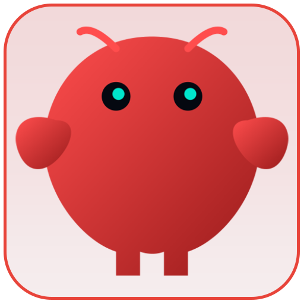
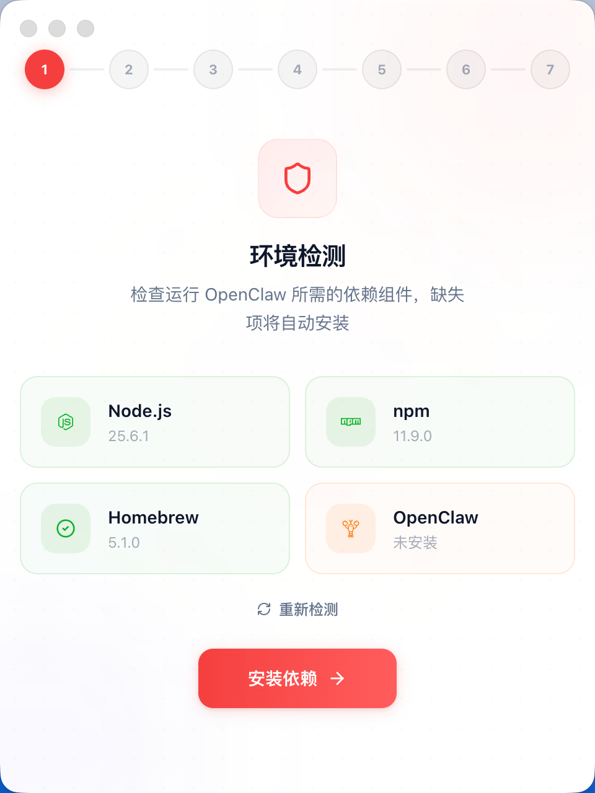
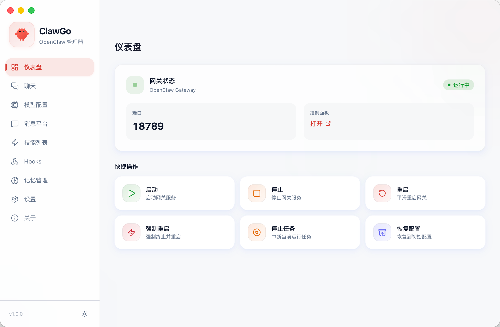
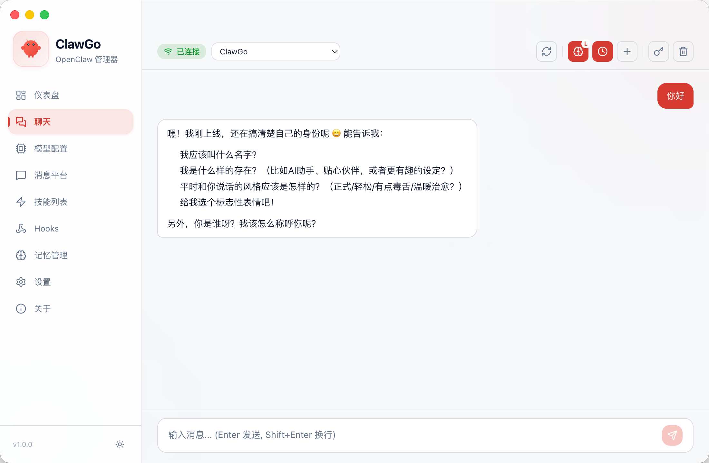

  

<h1 align="center">ClawGo</h1>

  <strong>OpenClaw 的图形化管家</strong> 
  安装、配置、运维，全程鼠标点点就行，不碰命令行。

  
  
  

---

## 这是什么

[OpenClaw](https://github.com/nicepkg/openclaw) 是一个开源 AI Agent 框架，支持 22+ 消息平台接入。但安装过程需要 Node.js、npm、命令行操作，对非技术用户是巨大障碍。

ClawGo 把整个流程包装成桌面应用 — 选服务商、填 Key、点安装，搞定。

## 下载安装

从 [Releases](../../releases) 页面下载对应平台的安装包：

| 平台 | 文件 | 说明 |
|------|------|------|
| Windows | `clawgo-x.x.x-setup.exe` | 双击运行安装 |
| macOS | `clawgo-x.x.x.dmg` | 拖入 Applications |

> 首次启动会自动检测环境并引导安装 OpenClaw，无需提前准备任何依赖。

## 功能一览

### 一键安装向导

- 自动检测系统环境（Node.js、npm）
- 缺失依赖一键补装，Node.js 版本过低自动升级到 v22+
- 支持 30+ AI 模型服务商（Anthropic、OpenAI、Google、火山引擎、智谱、通义千问、Moonshot 等）
- 端口冲突自动检测并切换可用端口
- 国内网络自动识别，使用镜像源加速
- 安装失败智能诊断，给出中文解决建议

### 网关控制

- 启动 / 停止 / 重启 / 强制重启
- 停止当前 AI 任务
- 运行状态实时监控

### AI 对话

- 内置聊天界面，安装完直接聊
- 支持多会话管理
- 流式输出，实时显示 AI 回复
- Markdown 渲染 + 代码高亮

### 模型管理

- 可视化切换 AI 服务商和模型
- 多模型共存，一键切换主模型
- API Key 安全管理
- 支持 OAuth 登录（GitHub Copilot、通义千问等）

### 消息平台

- WhatsApp、Telegram、Discord、Slack
- 飞书、企业微信、QQ、钉钉
- 插件一键安装，配置可视化
- 连接状态实时显示

### 技能 & Hooks

- 可视化启用/禁用技能插件
- 自动化 Hooks 管理

### 记忆管理

- 查看 / 编辑 / 删除 AI 记忆文件
- 编辑用户信息（USER.md）
- 支持每日记忆日志浏览

### 运维工具

- 一键升级 OpenClaw（stable / beta / dev）
- 配置自动备份 & 一键回滚
- `openclaw doctor` 智能诊断
- 强制修复重启
- 完整卸载（清理所有配置和数据）

## 截图

<table>
  <tr>
    <td align="center"><strong>安装向导</strong></td>
  </tr>
  <tr>
    <td></td>
  </tr>
  <tr>
    <td align="center"><strong>仪表盘</strong></td>
  </tr>
  <tr>
    <td></td>
  </tr>
  <tr>
    <td align="center"><strong>聊天界面</strong></td>
  </tr>
  <tr>
    <td></td>
  </tr>
</table>

## 系统要求

- Windows 10+ / macOS 10.15+
- 约 200MB 磁盘空间
- 网络连接（首次安装需要下载依赖）

## 常见问题

安装时提示 Node.js 版本过低？

ClawGo 会自动检测并升级 Node.js 到 v22+。如果自动升级失败，请手动从 [nodejs.org](https://nodejs.org) 下载安装 v22 LTS。

Windows 安装 OpenClaw 报权限错误？

以管理员身份运行 ClawGo，或手动修复 npm 全局目录权限。ClawGo 会尝试自动修复权限问题。

端口 18789 被占用？

ClawGo 会自动检测端口冲突并切换到 18790-18799 范围内的可用端口。

国内网络安装很慢？

ClawGo 会自动检测网络环境，国内用户自动使用 npmmirror 镜像源加速。

如何完全卸载？

设置页面 → 危险操作 → 卸载 OpenClaw。会清理所有配置、数据和 CLI。

## 交流群

有问题或建议，欢迎加微信交流：

  
  &nbsp;&nbsp;&nbsp;&nbsp;
  

  左：个人微信 &nbsp;|&nbsp; 右：微信群

## 技术栈

Electron 39 · React 19 · TypeScript · Tailwind CSS 4 · electron-vite 5

## License

[MIT](LICENSE)

## 致谢

- [OpenClaw](https://github.com/nicepkg/openclaw) — 强大的开源 AI Agent 框架
- [Electron](https://www.electronjs.org/) — 跨平台桌面应用框架
- [Lucide](https://lucide.dev/) — 图标库
